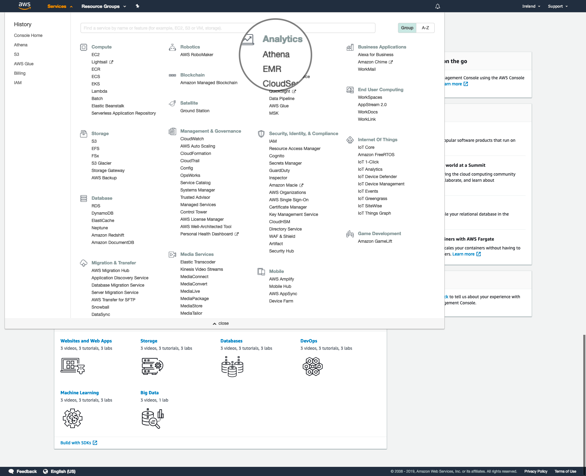
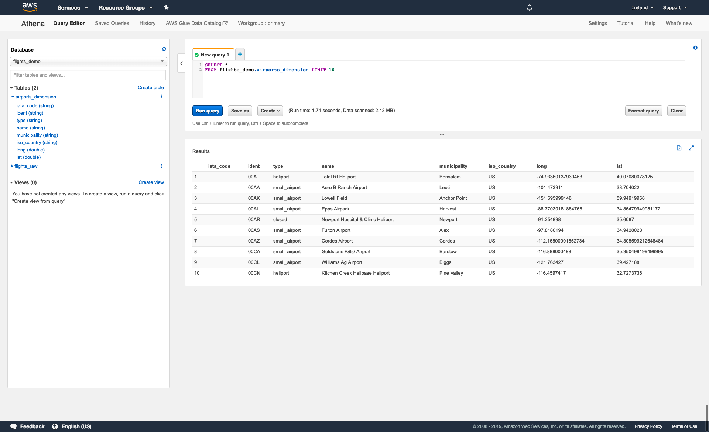
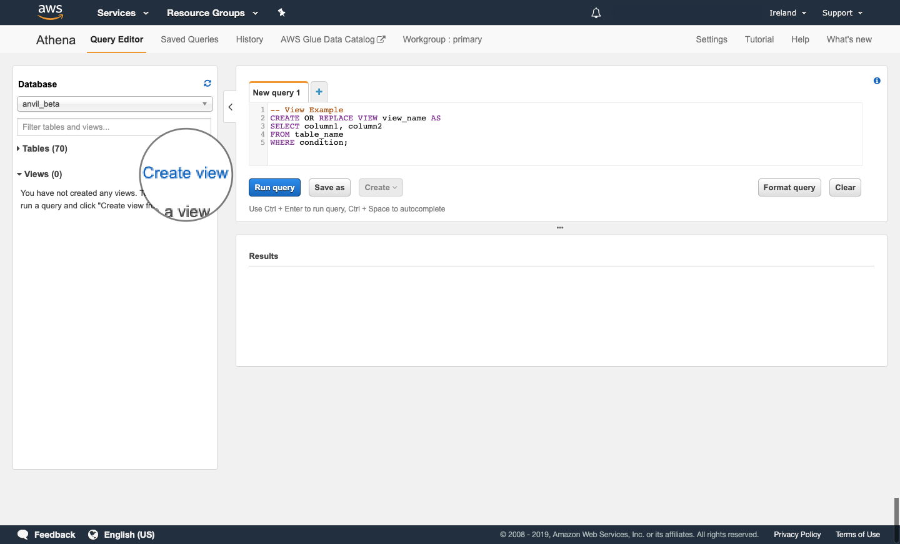
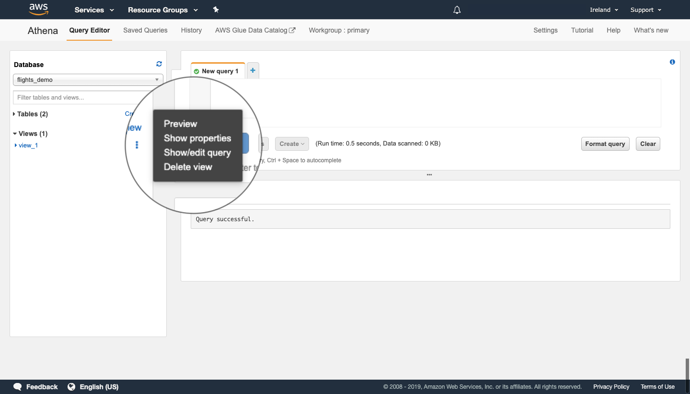
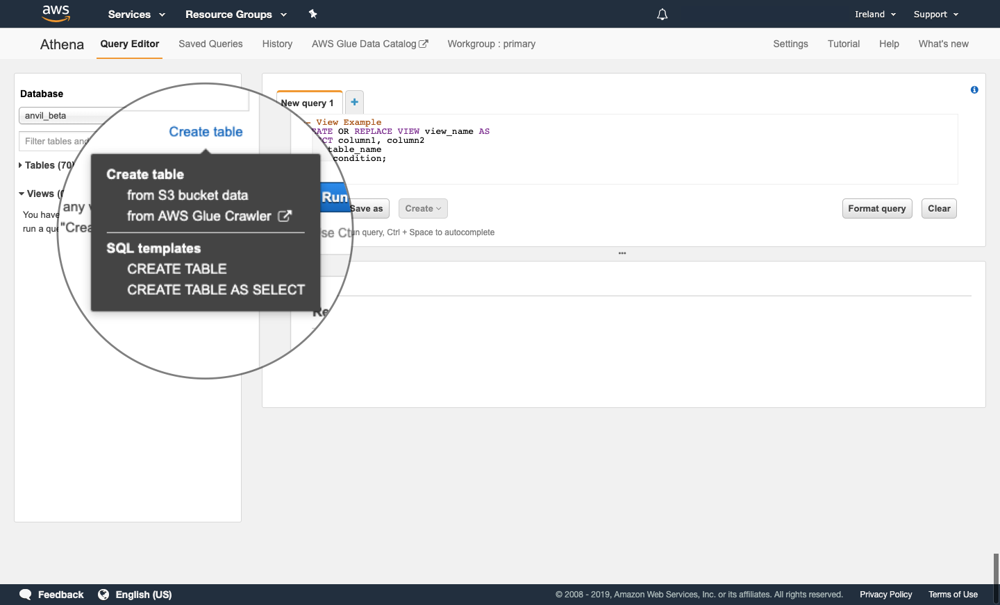
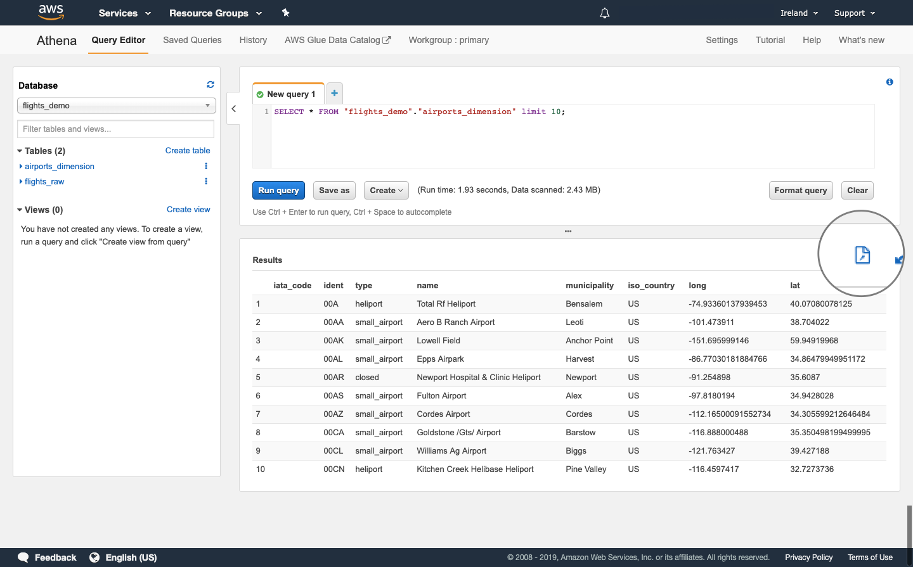

# Amazon Athena

>   Amazon Athena is an interactive query service that makes it easy to analyze data directly in Amazon Simple Storage Service (Amazon S3) using standard SQL. With a few actions in the AWS Management Console, you can point Athena at your data stored in Amazon S3 and begin using standard SQL to run ad-hoc queries and get results in seconds.
>
> Source: <cite><a href=https://docs.aws.amazon.com/athena/latest/ug/what-is.html>AWS</a></cite>

## Accessing Amazon Athena

To access the AWS console, click [here](https://aws.services.alpha.mojanalytics.xyz). You may need to login with GitHub and go through two-factor authentication.

To access Athena, click 'Services', then 'Athena'.



This will bring you to the Athena query editor. Here, you can:

*   access and create databases, tables and views;
*   write, run and save queries; and
*   view and download query outputs to your local computer.



## Previewing tables and views

In many cases, it may be useful to preview a table or view to get a better understanding of its structure and contents.

To preview a table or view, select a database using the dropdown menu and find the object you want to preview either directly from the list or using the 'Filter table and views...' search bar.

You can view the name and type of each column in a table or view by clicking the blue arrow to the left of the object name.

To run a query to preview a table or view, click the three dots (⋮) to the right of the object name and click 'Preview table'. This will run the following query that selects all columns from the table or view and returns 10 rows from the output:

```{}
SELECT *
FROM database_name.table_or_view_name
LIMIT 10;
```

## Working with views

You can create, update and delete views using the code described in Section \@ref(), however, you can also take advantage of the Athena UI.

### Creating a view

Clicking 'Create view' in the database window generates an example query that you can edit to create a new view.



### Modifying and deleting a view

To modify a view, click the three dots (⋮) to the right of the view name and click 'Show/edit query'.

To delete a view, click the three dots (⋮) to the right of the view name and click 'Delete view'.



## Working with tables

As for views, you can create, update and delete tables using the code described in Section \@ref(), however, you must also specify the storage format and location of the table in S3.

You can also use the Athena UI. In particular, the Athena UI allows you to create tables directly from data stored in S3 or by using the AWS Glue Crawler. We will not cover use of the AWS Glue Crawler in this guidance.

### Creating a table

#### Using code

If using code to create a table in Athena, you must also specify the storage format and location of the table in S3.

If creating a table from existing data, you can specify this information using the `WITH` statement.

```{}
CREATE TABLE IF NOT EXISTS database_1.table_1
    WITH (format = 'format', external_location = 'location') AS
SELECT *
FROM database_name.table_name;
```

Here, `format` can be any of the following:

*   `ORC`
*   `PARQUET`
*   `AVRO`
*   `JSON`
*   `TEXTFILE`

If `format` is not specified, `PARQUET` is used by default.

Additionally, `location` is the S3 path where you would like to store the table, e.g., `s3://alpha-everyone`.

There are several other parameters that you can specify. Information on these parameters can be found [here](https://docs.aws.amazon.com/athena/latest/ug/create-table-as.html).

If you are creating a new table, you can specify the storage format using the `STORED AS` statement and the storage location using the `LOCATION` statement.

```{}
CREATE TABLE IF NOT EXISTS table_1 AS (
    column_name1 column_type1,
    column_name2 column_type2,
    ...
)
STORED AS 'format'
LOCATION 'location';
```

Here, `format` and `location` are the same as above.

#### Using the Athena UI

Clicking 'Create table' in the database window brings up a menu list with the following options:

*   __Create table__
    +   From S3 bucket data
    +   from AWS Glue Crawler
*   __SQL templates__
    +   CREATE TABLE
    +   CREATE TABLE AS SELECT



Clicking 'CREATE TABLE' or 'CREATE TABLE AS SELECT' generates an example query that you can edit to create a new table. These example queries are of the same form as those described in the previous section.

Clicking 'from S3 bucket data' will open a new window that guides you through four steps to create a new table from data in S3:

*   __Step 1:__ Select which database to store your table in, input a name for your table and input the S3 path to the data from which you want to make the table. The S3 path should be of the form `s3://bucket/folder/`.
*   __Step 2:__ Select the format of the input data. You may also have to complete additional fields depending on the format of the input data.
*   __Step 3:__ Input the name and data type of each column in the table. When adding a large number of columns, it may be easier to use the 'Bulk add columns' option.
*   __Step 4:__ Select whether you want to partition the data in the table. This step is optional.

### Deleting a table

To delete a table using the Athena UI, click the three dots (⋮) next to the name of the table you want to delete and click 'Delete table'.

## Running queries

To create and run a new query:

1.  select the plus (+) tab above the editor window;
2.  write your code in the editor window (or copy and paste from another editor); and 
3.  click 'Run query'.

Progress information, including the estimated time elapsed will be displayed in the results window while the query is being processed.

Once the query has been completed, the output will be displayed in the results window.

You can save a query (not including the resulting output) by clicking 'Save as' and entering a name and description. Saved queries are available from the 'Saved Queries' tab in the Athena toolbar.

You can also create tables and views from queries by clicking 'Create' and entering a name. Tables and views that you create will be visible in the database window at the left of the page.

## Downloading query outputs

When you have run a query, you can download the output to your local computer as a csv file.

To download the output, click the page icon above the results table.


