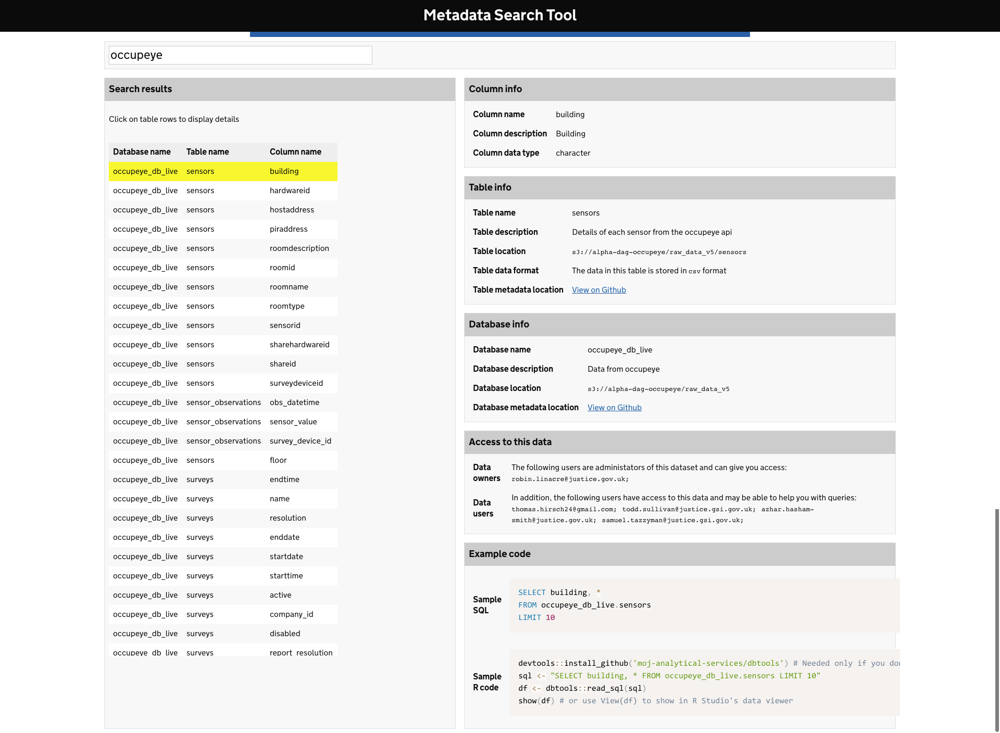

# Metadata search tool

## Overview

The metadata search tool scans repositories in the [MoJ Analytical Services](https://github.com/moj-analytical-services/) GitHub organisation for metadata files that follow a specific [schema](https://raw.githubusercontent.com/moj-analytical-services/etl_manager/master/etl_manager/specs/table_schema.json). The tool contains metadata for all the curated databases.

The tool displays the following information:

*   __Column info:__
    +   Column name
    +   Column description
    +   Column data type
*   __Table info:__
    +   Table name
    +   Table description
    +   Table location
    +   Table data format
    +   Table metadata location
*   __Database info:__
    +   Database name
    +   Database description
    +   Database location
    +   Database metadata location
*   __Access to the data:__
    +   Data owners
    +   Data users
*   __Example code:__
    +   Sample SQL code
    +   Sample R code

You can search for metadata based on the names or descriptions of columns, tables or databases.

## Accessing the tool

You can access the metadata search tool [here](https://metadata-vis.apps.alpha.mojanalytics.xyz).

Access requires sign-in using an email link or one-time passcode. To request access, contact the Analytical Platform team on the [#ap_admin_request](https://asdslack.slack.com/messages/CBLAGCQG6/) Slack channel or by [email](mailto:analytical_platform@digital.justice.gov.uk), if you are a Quantum user.